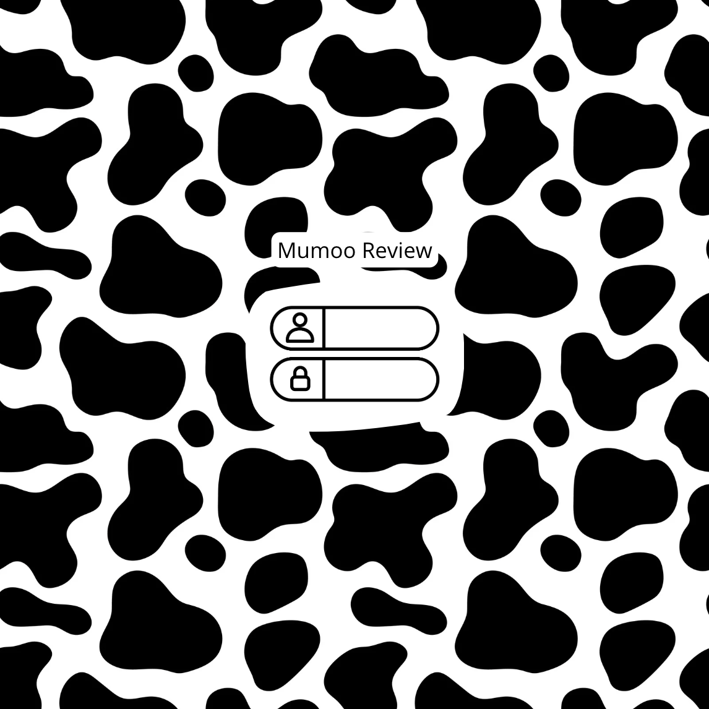

# Mumoo Review

[My Notes](notes.md)

A site similar to Goodreads except for rating and reviewing multiple different types of media, namely: music, books, and movies. Each user will have an account and may connect with friends. They then can make reviews of different pieces of media and view their friend's reviews as well. 

> [!NOTE]
>  This is a template for your startup application. You must modify this `README.md` file for each phase of your development. You only need to fill in the section for each deliverable when that deliverable is submitted in Canvas. Without completing the section for a deliverable, the TA will not know what to look for when grading your submission. Feel free to add additional information to each deliverable description, but make sure you at least have the list of rubric items and a description of what you did for each item.

> [!NOTE]
>  If you are not familiar with Markdown then you should review the [documentation](https://docs.github.com/en/get-started/writing-on-github/getting-started-with-writing-and-formatting-on-github/basic-writing-and-formatting-syntax) before continuing.

## 🚀 Specification Deliverable

> [!NOTE]
>  Fill in this sections as the submission artifact for this deliverable. You can refer to this [example](https://github.com/webprogramming260/startup-example/blob/main/README.md) for inspiration.

For this deliverable I did the following. I checked the box `[x]` and added a description for things I completed.

- [x] Proper use of Markdown
- [x] A concise and compelling elevator pitch
- [x] Description of key features
- [x] Description of how you will use each technology
- [x] One or more rough sketches of your application. Images must be embedded in this file using Markdown image references.

### Elevator pitch

Do you wish that there was one place to review multiple types of media? That is what Mumoo review offers: a single app to rate media and connect with friends. Mumoo review offers reviewing for movies, music, and books. You can add your friends and see their favorite books, movies, and music as well!

### Design

Here is a quick look at what the application would roughly look like. Each user has an account, so there is a login screen. There are three different pages, one for each type of media. Users can add a new item or simply look at past reviews. They also have access to their friends, their profile, and the ability to sign out through the username button at the top right of the screen.

### Key features

- secure login over HTTPS
- Display of past reviews
- Ability to add new reviews for other pieces of media
- Ability to connect with other users and see their reviews
- Notification when friends post reviews

### Technologies

I am going to use the required technologies in the following ways.

- **HTML** - Correct HTML structure for application. It will use 4 pages. One for each media type, and one for login.
- **CSS** - Application styling that fits different devices, whitespace and colors.
- **React** - When you click on each tab at the top left, it takes you to that page. When you click on the plus sign or the username, it will pop open a box with more options.
- **Service** - Using PurgoMalum to protect against inappropriate behavior from users. Interact with the database to retrieve the user's account.
- **DB/Login** - Store past reviews, and users in database. Register new users and store their accounts securely.
- **WebSocket** - Notifies other users when a new review is posted by one of their friends.

## 🚀 AWS deliverable

For this deliverable I did the following. I checked the box `[x]` and added a description for things I completed.

- [x] **Server deployed and accessible with custom domain name** - [My server link](https://mumooreview.click).

## 🚀 HTML deliverable

For this deliverable I did the following. I checked the box `[x]` and added a description for things I completed.

- [x] **HTML pages** - I made pages for books, movies, music, and login.
- [x] **Proper HTML element usage** - I used the proper elements for input boxes
- [x] **Links** - there are links to each of the different media pages on every page.
- [x] **Text** - I have textual content on my site
- [x] **3rd party API placeholder** - I added a quote from a movie. My third party API will generate random movie quotes when the application is opened.
- [x] **Images** - added an image of a cow to each page
- [x] **Login placeholder** - I made a login page
- [x] **DB data placeholder** - login section with a box for username and for password. Also a record of the past reviews made by the user.
- [x] **WebSocket placeholder** - I made a page that shows the latest reivews done by friends

## 🚀 CSS deliverable

For this deliverable I did the following. I checked the box `[x]` and added a description for things I completed.

- [x] **Header, footer, and main content body** - centering for header and footer, centering and border around the main content
- [x] **Navigation elements** - made them into buttons, when you hover over them they change color
- [x] **Responsive to window resizing** - 
- [x] **Application elements** - 
- [x] **Application text content** - 
- [x] **Application images** - made the images have a transparent background and increased the size on the login page

## 🚀 React part 1: Routing deliverable

For this deliverable I did the following. I checked the box `[x]` and added a description for things I completed.

- [ ] **Bundled using Vite** - I did not complete this part of the deliverable.
- [ ] **Components** - I did not complete this part of the deliverable.
- [ ] **Router** - Routing between login and voting components.

## 🚀 React part 2: Reactivity

For this deliverable I did the following. I checked the box `[x]` and added a description for things I completed.

- [ ] **All functionality implemented or mocked out** - I did not complete this part of the deliverable.
- [ ] **Hooks** - I did not complete this part of the deliverable.

## 🚀 Service deliverable

For this deliverable I did the following. I checked the box `[x]` and added a description for things I completed.

- [ ] **Node.js/Express HTTP service** - I did not complete this part of the deliverable.
- [ ] **Static middleware for frontend** - I did not complete this part of the deliverable.
- [ ] **Calls to third party endpoints** - I did not complete this part of the deliverable.
- [ ] **Backend service endpoints** - I did not complete this part of the deliverable.
- [ ] **Frontend calls service endpoints** - I did not complete this part of the deliverable.

## 🚀 DB/Login deliverable

For this deliverable I did the following. I checked the box `[x]` and added a description for things I completed.

- [ ] **User registration** - I did not complete this part of the deliverable.
- [ ] **User login and logout** - I did not complete this part of the deliverable.
- [ ] **Stores data in MongoDB** - I did not complete this part of the deliverable.
- [ ] **Stores credentials in MongoDB** - I did not complete this part of the deliverable.
- [ ] **Restricts functionality based on authentication** - I did not complete this part of the deliverable.

## 🚀 WebSocket deliverable

For this deliverable I did the following. I checked the box `[x]` and added a description for things I completed.

- [ ] **Backend listens for WebSocket connection** - I did not complete this part of the deliverable.
- [ ] **Frontend makes WebSocket connection** - I did not complete this part of the deliverable.
- [ ] **Data sent over WebSocket connection** - I did not complete this part of the deliverable.
- [ ] **WebSocket data displayed** - I did not complete this part of the deliverable.
- [ ] **Application is fully functional** - I did not complete this part of the deliverable.
